<div style="display: flex; justify-content: space-between;">
   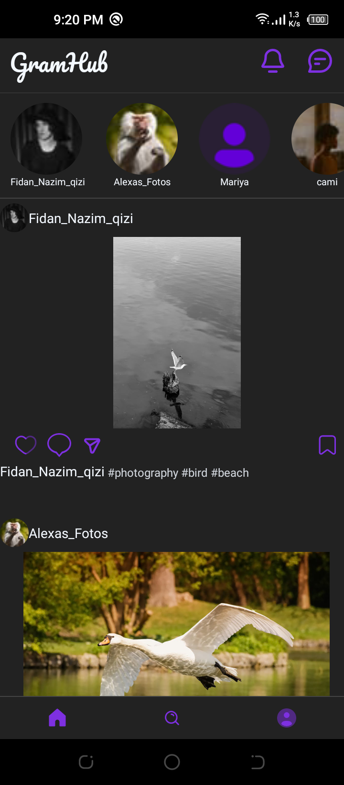
   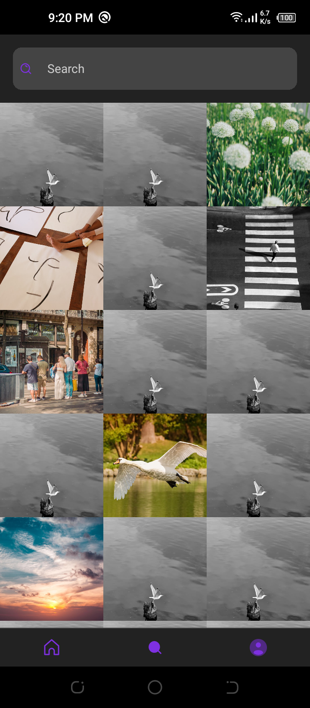
   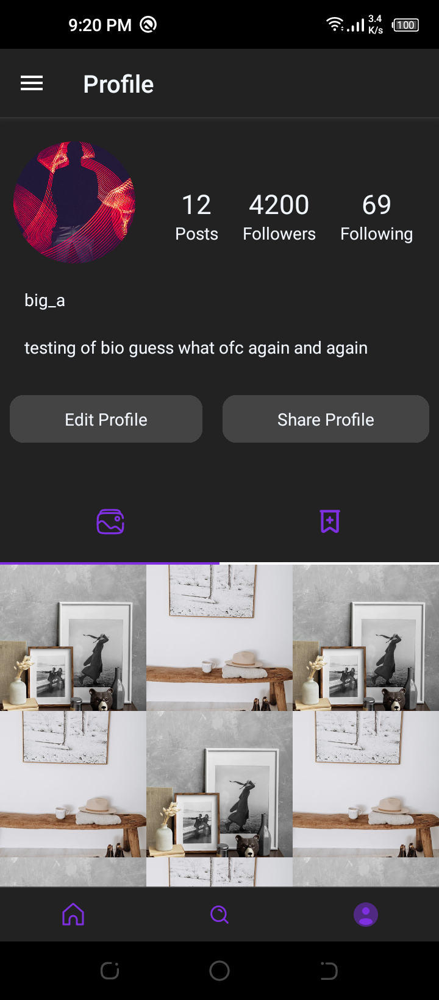
   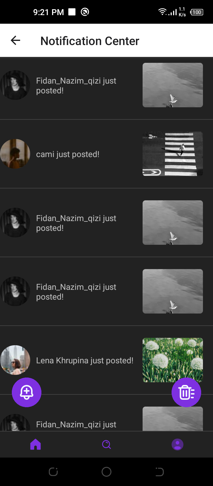
   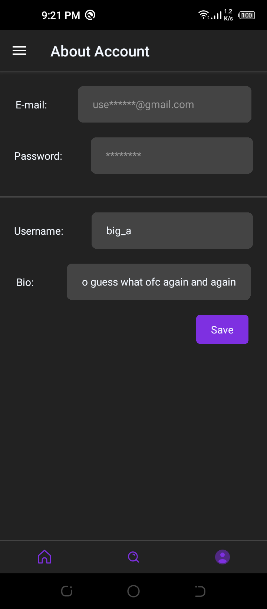
   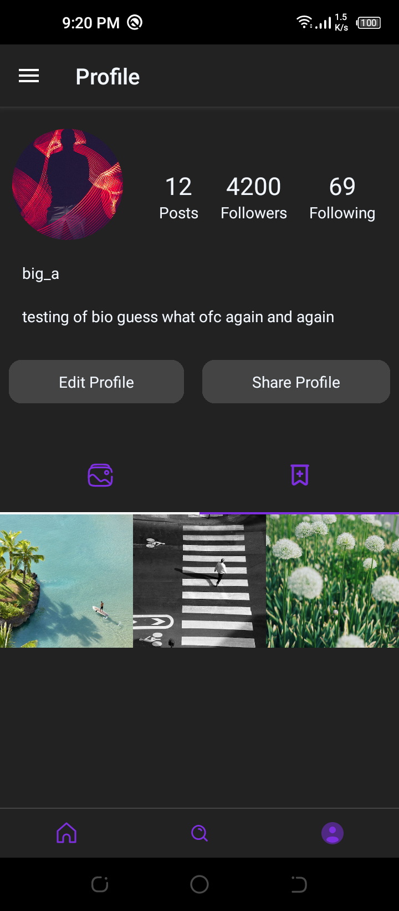
   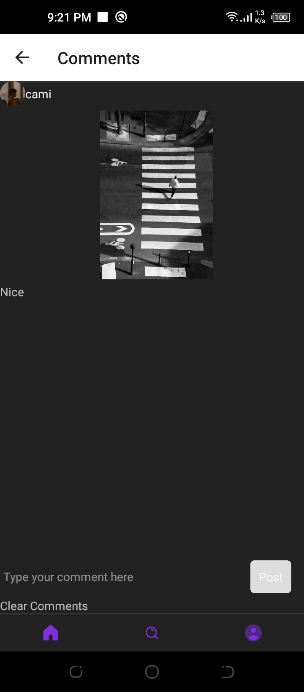
   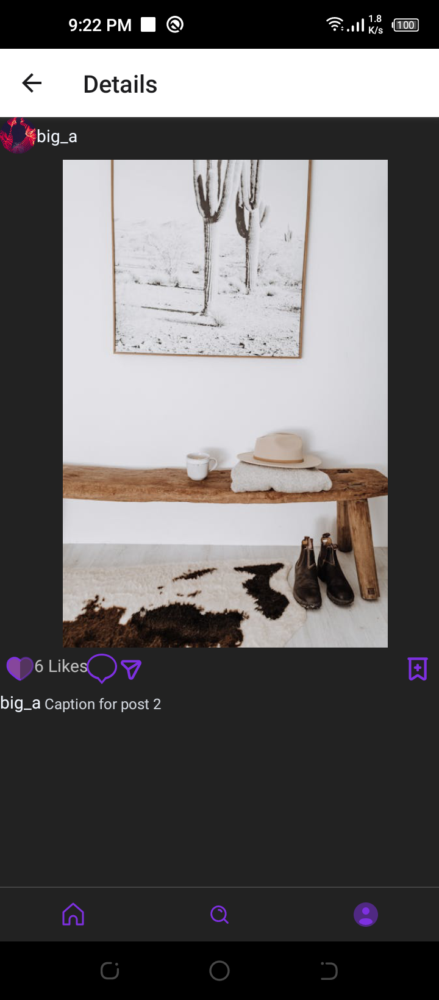
</div>

# GramHub

GramHub is a [React Native](https://reactnative.dev/) application like [Instagram](https://www.instagram.com/) for users to showcase their profiles and posts.

## Profiling

Here are some screenshots of the profiling:

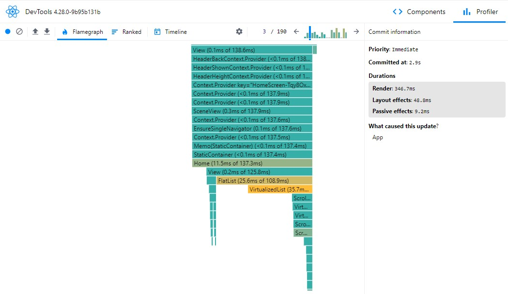
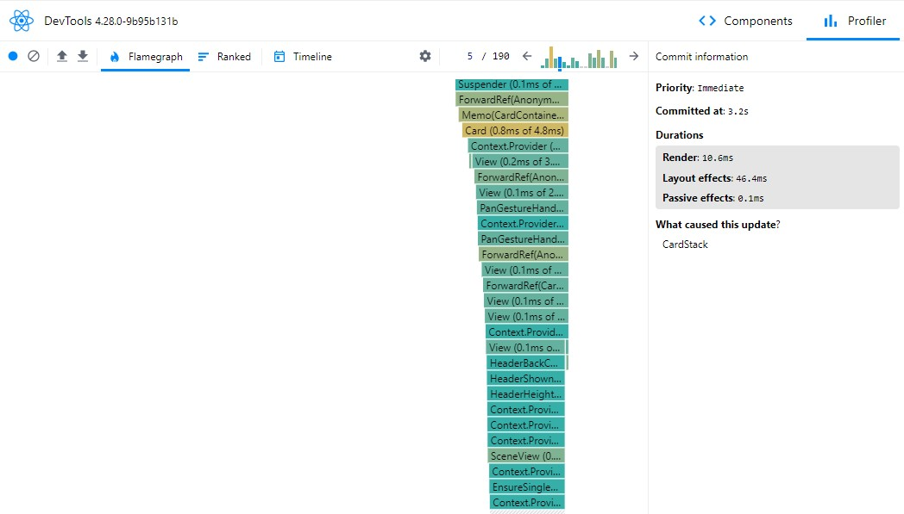
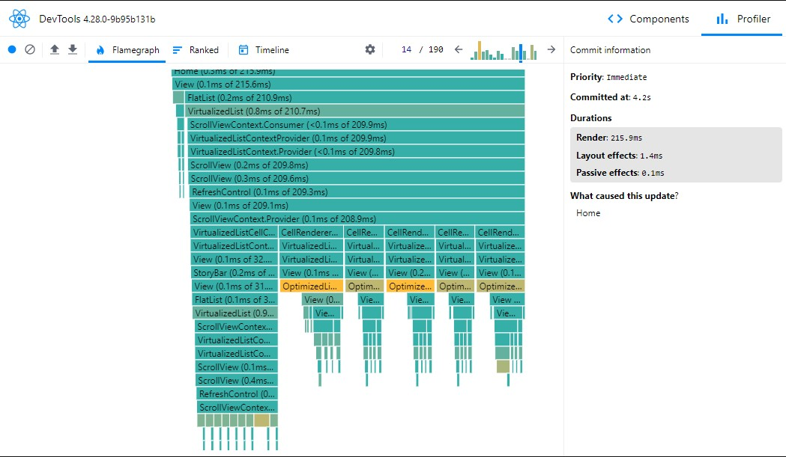

## Features

- View user profile details including name, avatar, followers, following, and bio.
- Display user's posts with images and captions.
- Edit profile functionality (name and bio).
- Share profile functionality with deep linking support.
- Saving comments using redux state management.
- Authentication flow.
- Add to clipboard button to share profile.
- Like, save and comment functionnalities.
- Notification on like, dislike and from notification center on new posts (using a button).

## Installation

Make sure you have [Node.js](https://nodejs.org/) installed.

1. Clone this repository:

   ```bash
   git clone https://github.com/yourusername/GramHub.git
   ```

2. Navigate to the project directory:

   ```bash
   cd GramHub
   ```

3. Install dependencies:

   ```bash
   npm install
   ```

## Usage

1. Start the Metro server:

   ```bash
   npm start
   ```

2. Run the application on Android:

   ```bash
   npm run android
   ```

   Or run the application on iOS:

   ```bash
   npm run ios
   ```

3. Follow the on-screen instructions to interact with the application.

## Dependencies

- [@notifee/react-native](https://www.npmjs.com/package/@notifee/react-native): For displaying notifications.
- [@react-native-async-storage/async-storage](https://www.npmjs.com/package/@react-native-async-storage/async-storage): For asynchronous storage support.
- [@react-native-clipboard/clipboard](https://www.npmjs.com/package/@react-native-clipboard/clipboard): For accessing and modifying the clipboard contents.
- And more...

## Development Dependencies

- [@babel/core](https://www.npmjs.com/package/@babel/core): Babel compiler core.
- [@react-native/babel-preset](https://www.npmjs.com/package/@react-native/babel-preset): Babel preset for React Native applications.
- [@react-native/eslint-config](https://www.npmjs.com/package/@react-native/eslint-config): Eslint config for React Native.
- And more...

## Contributing

Contributions are welcome! Feel free to open an issue or submit a pull request for any changes or improvements you'd like to make.

## License

This project is licensed under the [MIT License](LICENSE).
